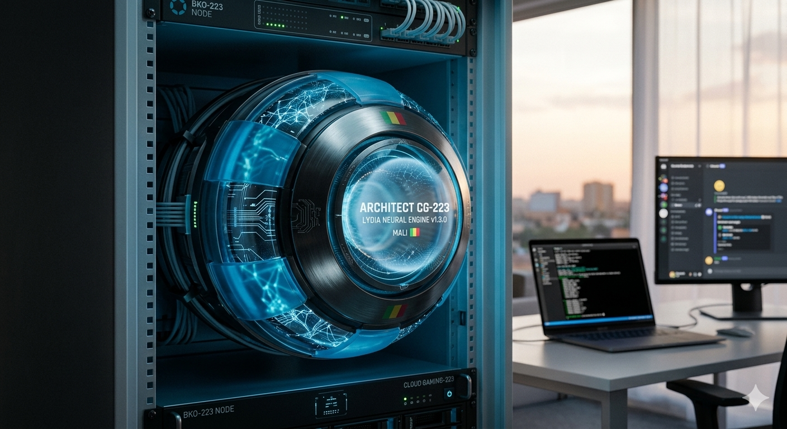

---

<div align="center">
  

  # 🦅 ARCHON CG-223 — NEURAL GRID

  
  
  
  <br/>
  
  
  
  
  
  
  

  **Enterprise-grade Discord bot — built on a phone, deployed from Bamako, Mali 🇲🇱**

  [**Dashboard**](https://bamako-steel-dev.xyz) • [**Invite**](https://discord.com/oauth2/authorize?client_id=1472707869257367676&permissions=8&scope=bot%20applications.commands) • [**Support**](https://discord.gg/NFSMFJajp9) • [**Vote**](https://top.gg/bot/1472707869257367676)
</div>

---

## 📋 OVERVIEW

**ARCHON CG-223** is a full-stack Discord bot with per-server isolation, bilingual EN/FR support, AI conversations, music streaming, economy system, moderation, leveling, badge system, and a React dashboard. Built and deployed entirely from a mobile phone via Termux + SSH on a Hetzner VPS in Bamako, Mali.

| Name | Description |
|------|-------------|
| `cloud-gaming-223-digital-engine` | GitHub Repository |
| `ARCHON CG-223` | Bot display name in Discord |
| `BAMAKO_223` | Node name in logs & PM2 |
| `BAMAKO-STEEL-NODE` | Hetzner VPS hostname |
| `bamako-steel-dev.xyz` | Dashboard domain |

---

## ✨ FEATURE MATRIX

### 🎵 Music Engine

| Feature | Description |
|---------|-------------|
| `/music play` | Stream from SoundCloud (primary) → YouTube via yt-dlp (fallback) |
| `/music file` | Upload any audio file (mp3/wav/ogg/flac) directly from phone |
| `/music pause` | Pause or resume playback |
| `/music skip` | Skip to next track |
| `/music stop` | Stop and disconnect |
| `/music queue` | View queued tracks |
| `/music volume` | Set volume 1-100 |
| `/music loop` | Toggle loop mode |
| `/music autoplay` | Auto-queue similar tracks when queue empties |
| `/music nowplaying` | Show current track with progress |
| Stage Support | Bot becomes speaker automatically in stage channels |
| Spotify Metadata | Album art, artist, duration from Spotify API |
| Persistent Panel | One message updates every 15s — no spam |
| Suggested Songs | Recommends tracks based on server play history |

### 🧠 AI — Lydia Neural Engine

| Feature | Description |
|---------|-------------|
| Multi-model | Llama 3.1, Gemini, Mistral via OpenRouter |
| Per-server AI | Enable/disable per server from dashboard |
| 111 plugins | Full bot knowledge base |
| Vision | Image analysis support |
| AFK system | Auto-respond when AFK |
| Bilingual | EN/FR per server or auto-detect |

### 💰 Economy System

| Feature | Description |
|---------|-------------|
| Per-server credits | Isolated balance per server |
| Daily rewards | Streak system with streak protections |
| Shop | Badges, XP boosts, credit boosts, VIP roles |
| Badge system | Buy & equip badges — display on `/profile` |
| Transfer | Send credits to other users with confirmation |
| Market | Live dynamic market with investments |
| Giveaways | Premium giveaway system with entry tracking |
| `/use` | Dynamic inventory with select menu |

### 📈 Leveling

| Feature | Description |
|---------|-------------|
| Per-server XP | Configurable cooldown, min/max gain, multiplier |
| Level-up cards | Canvas-rendered cards via @napi-rs/canvas |
| Neural ranks | NEURAL RECRUIT → SYSTEM ARCHITECT |
| Wealth tiers | BROKE → FINANCIAL LEGEND |
| Server leaderboard | XP/credits/streak/messages rankings |
| Profile dossier | Classified police-style agent profile |

### 🛡️ Moderation

| Feature | Description |
|---------|-------------|
| AutoMod | Spam, caps, emoji flood, link/invite filter |
| Warnings | Per-server warning system with auto-actions |
| Audit log | Full moderation history in dashboard |
| Appeal system | Users can appeal AutoMod actions via DM |
| Moderation logs | All actions tracked in SQLite |
| Timeout/Ban/Kick | Full moderation toolkit |

### 👋 Welcome/Goodbye

| Feature | Description |
|---------|-------------|
| Canvas cards | 600×170 2x scale cards with avatar + glow ring |
| Custom messages | `{user}` `{server}` `{count}` `{age}` placeholders |
| Per-server config | Channel, message, enable/disable from dashboard |
| Departure detection | Detects kick/ban vs voluntary leave |

### 🎮 Games

| Feature | Description |
|---------|-------------|
| Slots | Spin neural slots with credits |
| Blackjack | Beat the dealer |
| Roulette | Bet on your number |
| TicTacToe | 2-player with challenge system |
| CODM Simulator | Simulated ranked match results |

### 🌐 Dashboard — bamako-steel-dev.xyz

| Feature | Description |
|---------|-------------|
| Stack | React + Vite + tRPC + MySQL + Drizzle ORM |
| Auth | Discord OAuth2 login |
| General Settings | Prefix, language, timezone, welcome/goodbye |
| Economy Settings | Currency, daily bonus, tax, channels |
| Moderation Settings | AutoMod, thresholds, log channels |
| Leveling Settings | XP multiplier, cooldown, level-up channel |
| AI Settings | Enable/disable Lydia, AFK, Market |
| Reset buttons | Per-section reset with confirmation modal |
| Audit Log panel | Moderation history with action filters |
| Leaderboard panel | XP/credits/streak/messages rankings |
| Users panel | OAuth dashboard logins (owner only) |
| Admin panel | Full control room with live diagnostics |
| Premium toast | Color-coded save notifications with sync status |

---

## 🏗️ TECH STACK

```

Bot:           Node.js 20 + Discord.js v14
Database:      SQLite WAL (bot) + MySQL (dashboard)
AI:            OpenRouter — Llama 3.1, Gemini, Mistral
Music:         @discordjs/voice + play-dl + yt-dlp + ffmpeg
Music Meta:    Spotify Web API (album art, artist, duration)
Canvas:        @napi-rs/canvas (welcome cards, level-up)
Dashboard:     React + Vite + tRPC + Drizzle ORM
Hosting:       Hetzner VPS + Cloudflare + Nginx + PM2
Domain:        bamako-steel-dev.xyz
Dev Setup:     Mobile phone + Termux + SSH 🇲🇱
```

---

## 🚀 INSTALLATION

```bash
# 1. Clone the repository
git clone https://github.com/MFOF7310/cloud-gaming-223-digital-engine.git
cd cloud-gaming-223-digital-engine

# 2. Install Node dependencies
npm install

# 3. Install system dependencies
apt install ffmpeg
pip install yt-dlp --break-system-packages

# 4. Configure environment
cp .env.example .env
nano .env

# 5. Start with PM2
pm2 start index.js --name "Architect-CG223"
pm2 save
pm2 startup
```

---

## ⚙️ ENVIRONMENT VARIABLES

| Variable | Required | Description |
|----------|----------|-------------|
| `DISCORD_TOKEN` | ✅ | Discord bot token |
| `CLIENT_ID` | ✅ | Application client ID |
| `OWNER_ID` | ✅ | Your Discord user ID |
| `OPENROUTER_API_KEY` | ✅ | AI API for Lydia |
| `SPOTIFY_CLIENT_ID` | ✅ | Spotify API for music metadata |
| `SPOTIFY_CLIENT_SECRET` | ✅ | Spotify API secret |
| `GEMINI_API_KEY` | ❌ | Google Gemini Vision |
| `TELEGRAM_BOT_TOKEN` | ❌ | Telegram bridge |
| `TELEGRAM_CHAT_ID` | ❌ | Target Telegram chat |
| `PREFIX` | ❌ | Command prefix (default: `.`) |
| `GUILD_ID` | ❌ | Main server ID |
| `WELCOME_CHANNEL_ID` | ❌ | Fallback welcome channel |
| `TOPGG_WEBHOOK_SECRET` | ❌ | Top.gg vote webhook secret |

---

## 🔧 PM2 COMMANDS

```bash
pm2 status                    # View all processes
pm2 logs Architect-CG223      # Real-time logs
pm2 restart Architect-CG223   # Restart bot
pm2 stop Architect-CG223      # Stop bot
pm2 monit                     # Monitor CPU/RAM
pm2 flush Architect-CG223     # Clear logs
```

---

## 🔧 TROUBLESHOOTING

| Issue | Solution |
|-------|----------|
| Bot won't start | Check `DISCORD_TOKEN` and `CLIENT_ID` in .env |
| Music not playing | Ensure `ffmpeg` and `yt-dlp` are installed |
| Commands not responding | Enable MESSAGE CONTENT INTENT in Dev Portal |
| Database locked | Circuit breaker active — wait 60 seconds |
| Welcome not sending | Set `welcome_channel` in dashboard General settings |
| Voice connection failed | Check bot has Connect + Speak permissions |
| Shop not loading | Verify `client.shopItems` in index.js |
| Canvas errors | Run `npm install @napi-rs/canvas` |

---

## 📱 CONNECT

🌐 [Dashboard](https://bamako-steel-dev.xyz)
🔵 [Facebook](https://www.facebook.com/share/17KysmJrtm/)
🐙 [GitHub](https://github.com/MFOF7310)
💬 [Support Server](https://discord.gg/NFSMFJajp9)
⭐ [Vote on Top.gg](https://top.gg/bot/1472707869257367676)

---

## 🙏 CREDITS

- **Architect:** Moussa Fofana — MFOF7310
- **Community:** Eagle Community 🇲🇱
- **Node:** BAMAKO-STEEL-NODE (Hetzner EU)
- **Powered by:** Discord.js v14 · OpenRouter · Spotify · SQLite WAL · React · @napi-rs/canvas

---

<div align="center">
  <b>🏗️ Built with neural precision in Bamako, Mali 🇲🇱</b><br><br>
  
  <br><br>
  <i>"The grid adapts. The grid survives. The grid prevails."</i>
</div>
```

---