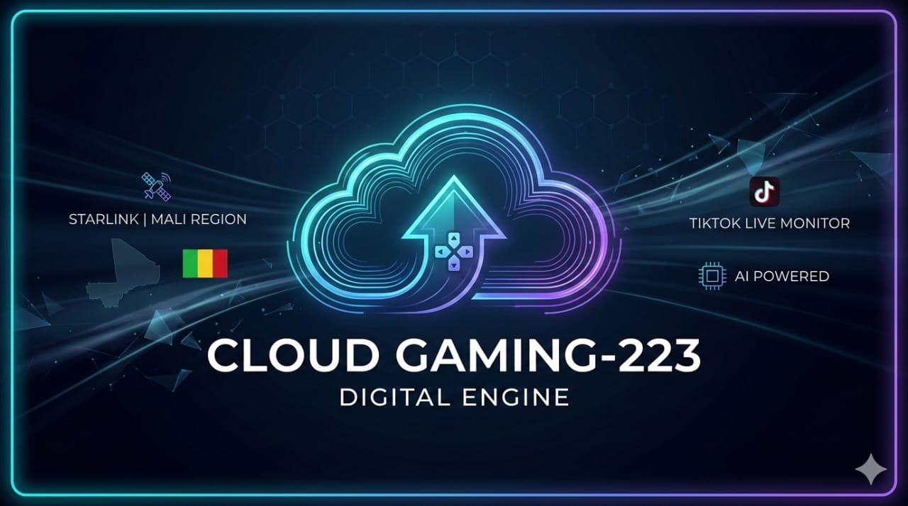

# 🎮 CLOUD GAMING-223 | DIGITAL ENGINE
> **Powered by Starlink 🛰️ | Optimized for Mali 🇲🇱 | AI-Core V2.5**

A high-performance, modular Discord bot engine designed for cloud gamers and streamers. Built with a specialized TikTok monitoring system and custom Google Gemini AI integration.

## 🚀 Key Features
* **🔴 TikTok Live Monitor:** Real-time stream detection with automatic duration tracking.
* **📦 Modular Engine:** 14+ active modules separated into `/plugins` and `/modules` for maximum speed.
* **🛡️ Security:** System commands are strictly locked to the Engine Owner ID.
* **📢 Broadcast:** Global announcement system to reach all connected servers instantly.
* **🧹 Smart Moderation:** High-speed message purging with temporary system feedback.

## 🔗 Connect with the Creator
Stay updated with the **Cloud Gaming-223** journey through our official channels:

* **📱 TikTok:** [cloudgaming223](https://www.tiktok.com/@cloudgaming223)
* **📸 Instagram:** [mfof7310](https://www.instagram.com/mfof7310)
* **💬 WhatsApp:** [Contact Community Support](https://wa.me/15485200518)
* **📍 Location:** Bamako, Mali

## 🛠️ Setup & Installation

### 1. Requirements
* Node.js v16.11.0 or higher.
* A Discord Bot Token (via Discord Developer Portal).
* A Google Gemini API Key.

### 2. Environment Configuration
Create a `.env` file in the root directory and add the following:
```env
DISCORD_TOKEN=your_token_here
GEMINI_API_KEY=your_key_here
TIKTOK_USERNAME=your_tiktok_id
OWNER_ID=your_discord_owner_id
CHANNEL_ID=your_notification_channel_id
PREFIX=,


---- 

## ⚖️ License & Disclaimer

### License
This project is licensed under the **MIT License**. 

> Permission is hereby granted, free of charge, to any person obtaining a copy of this software to deal in the Software without restriction, including without limitation the rights to use, copy, modify, merge, publish, distribute, sublicense, and/or sell copies of the Software, provided that the above copyright notice and this permission notice are included in all copies.

### Disclaimer
**CLOUD GAMING-223** is provided "as is". The creator is not responsible for any misuse, data loss, or server-side issues resulting from the deployment of this engine. Use at your own risk.
